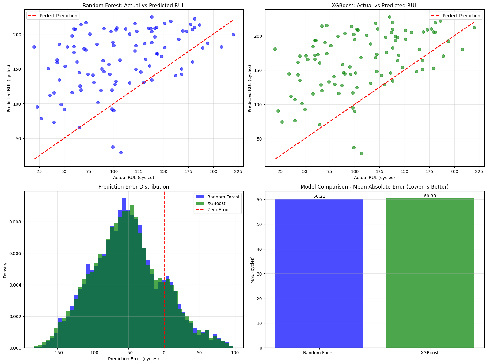
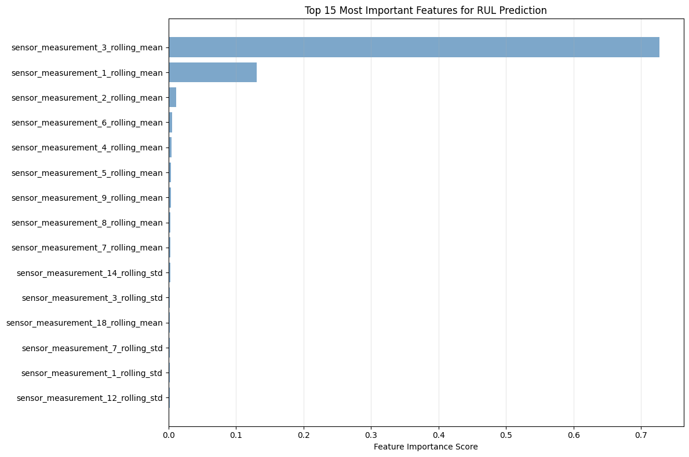

# 🎯 Predictive Maintenance for Military Vehicle Fleet

[](https://www.python.org/)
[](LICENSE)
[](.github/workflows/python-publish.yml)

> **AI-Powered Predictive Maintenance System** - Predicting Remaining Useful Life (RUL) of military vehicles using machine learning to optimize maintenance schedules and enhance operational readiness.

---

## 🚀 Features

### 🔧 Core Capabilities
- **RUL Prediction**: Accurate Remaining Useful Life estimation using sensor data
- **Real-time Monitoring**: Continuous vehicle health monitoring
- **Failure Forecasting**: Early detection of potential component failures
- **Maintenance Optimization**: Data-driven maintenance scheduling

### 📊 Data Processing
- **Sensor Data Integration**: Process multiple data streams from vehicle sensors
- **Feature Engineering**: Advanced feature extraction from time-series data
- **Data Validation**: Automated data quality checks and preprocessing
- **Anomaly Detection**: Identify unusual patterns in sensor readings

### 🤖 Machine Learning
- **Multiple Algorithms**: Ensemble methods, neural networks, and time-series forecasting
- **Model Explainability**: SHAP analysis and feature importance
- **Continuous Learning**: Model retraining with new data
- **Performance Monitoring**: Track model drift and accuracy over time

---

## 📈 Project Demo

### RUL Prediction Results

*Remaining Useful Life predictions vs actual values*

### Feature Importance

*Most influential features in predicting vehicle failures*

---

## 🏗️ Architecture

```mermaid
graph TD
    A[Vehicle Sensors] --> B[Data Collection]
    B --> C[Data Preprocessing]
    C --> D[Feature Engineering]
    D --> E[ML Model Training]
    E --> F[RUL Prediction]
    F --> G[Maintenance Alerts]
    G --> H[Dashboard Visualization]
